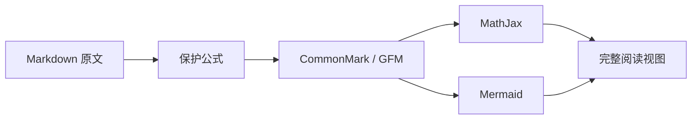

# MD Viewer 功能示例

这是一份用于验证渲染能力的文档。它同时包含 **CommonMark**、~~GFM 删除线~~、==高亮==、脚注[^note]、表格、任务列表、代码、数学公式与 Mermaid 图表。

## 数学公式

Codex 常用的块级分隔符可以直接恢复：

\[
\int_{-\infty}^{+\infty} e^{-x^2}\,dx = \sqrt{\pi}
\]

标准扩展写法也支持：

$$
\mathbf{V}_1 \times \mathbf{V}_2 =
\begin{vmatrix}
\mathbf{i} & \mathbf{j} & \mathbf{k} \\
\frac{\partial X}{\partial u} & \frac{\partial Y}{\partial u} & 0 \\
\frac{\partial X}{\partial v} & \frac{\partial Y}{\partial v} & 0
\end{vmatrix}
$$

行内公式不会破坏段落：爱因斯坦质能方程 \(E=mc^2\)，也可以写作 $\sum_{i=1}^{n} i = \frac{n(n+1)}{2}$。金额 `$12 and $20` 不会被误判成公式。

## 表格与任务

| 能力 | 语法 | 状态 |
| :--- | :---: | ---: |
| 标准正文 | CommonMark | ✅ |
| 表格/任务 | GFM | ✅ |
| 数学公式 | TeX / LaTeX | ✅ |
| 图表 | Mermaid | ✅ |

- [x] 离线渲染
- [x] macOS 与 iOS 共用代码
- [ ] 未来的插件扩展

## 代码高亮

```swift
struct Fibonacci: Sequence, IteratorProtocol {
    private var state = (0, 1)

    mutating func next() -> Int? {
        defer { state = (state.1, state.0 + state.1) }
        return state.0
    }
}
```

## Mermaid 图表



## 引用、链接与图片

> Markdown 是纯文本容器。数学和图表不是基础标准的一部分，必须由约定和渲染器共同恢复。

访问 [CommonMark](https://commonmark.org/) 查看基础规范。相对图片路径也会以当前文档所在目录为基准解析。

[^note]: 脚注是常用扩展，不属于最初的 Markdown 规范。
